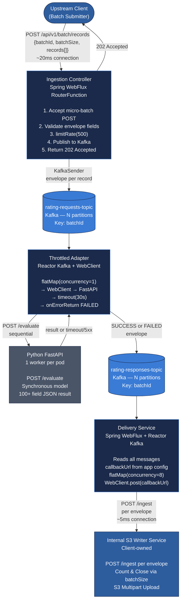
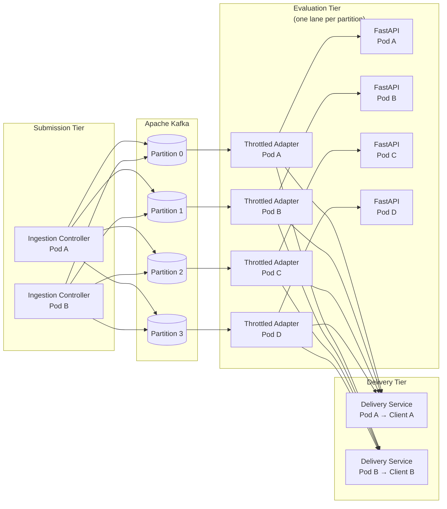
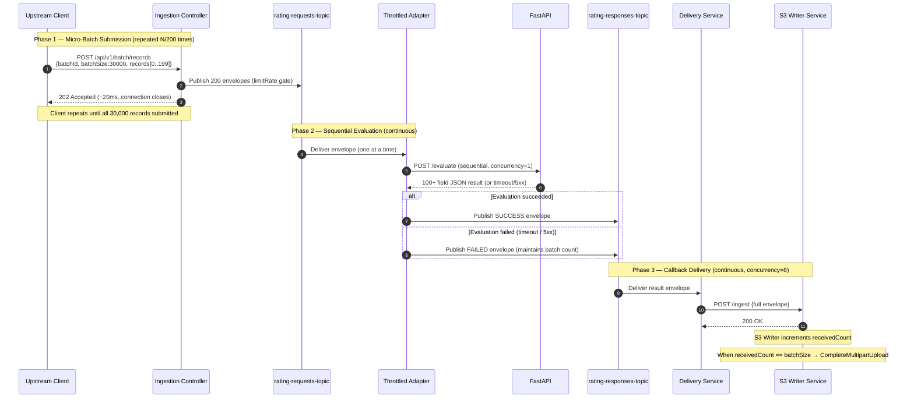
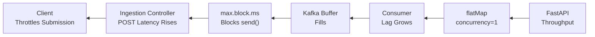
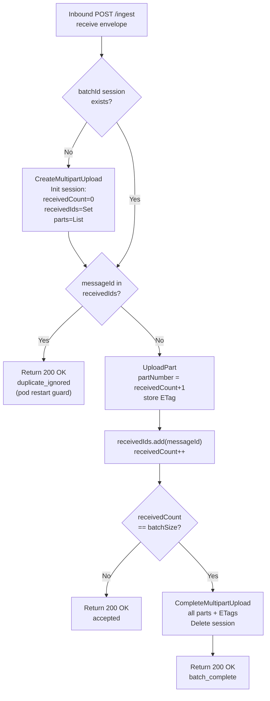
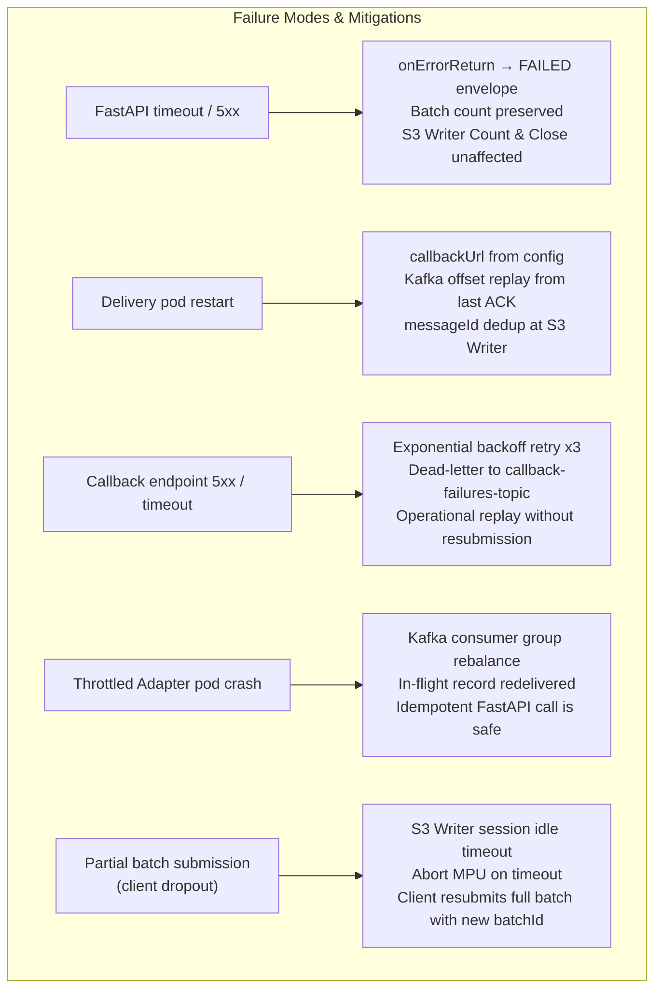
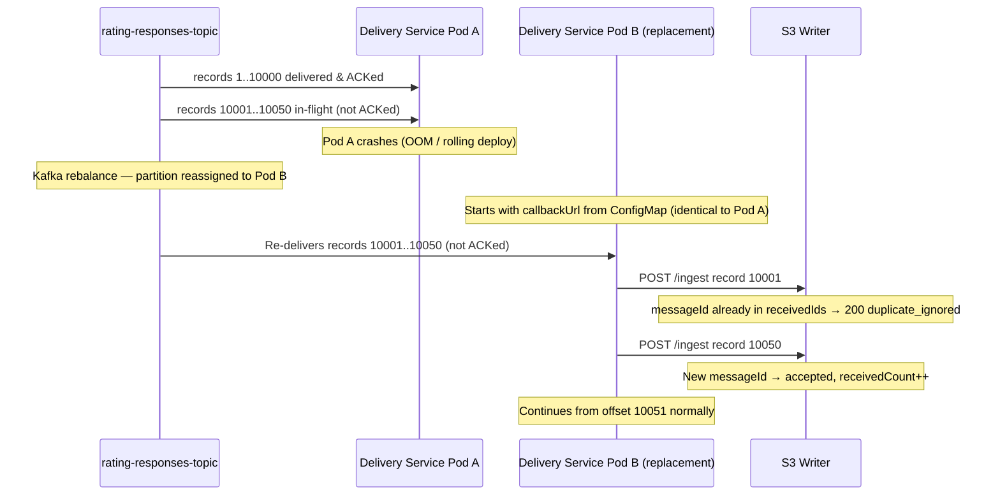

# Technical Design Document
## High-Throughput Asynchronous Financial Rating Evaluation System
### Reactive Streaming Migration — v2.0 Async Callback Delivery

---

| Field | Value |
|---|---|
| Document Version | 2.0 — Revised Draft |
| Status | Under Engineering Review |
| Classification | Internal — Restricted |
| Batch Volume | 30,000 Obligors / Run |
| Transport Protocol | HTTP/1.1 `application/json` — Micro-Batch POST + Per-Record Outbound Webhook |
| Delivery Model | Outbound Webhook (One Client per Delivery Pod) |
| Message Broker | Apache Kafka |
| Primary Framework | Spring Boot 3 / WebFlux |
| Evaluation Engine | Python FastAPI (Sequential) |

---

## Table of Contents

1. [Executive Summary & Architectural Paradigm Shift](#1-executive-summary--architectural-paradigm-shift)
2. [Component Architecture](#2-component-architecture)
3. [Sequence of Operations — Happy Path](#3-sequence-of-operations--happy-path)
4. [State & Metadata Management — The Envelope Contract](#4-state--metadata-management--the-envelope-contract)
5. [Resilience & Error Handling](#5-resilience--error-handling)
6. [Infrastructure & Tuning Recommendations](#6-infrastructure--tuning-recommendations)
- [Appendix A: Glossary](#appendix-a-glossary)
- [Appendix B: Decision Log](#appendix-b-decision-log)

---

## 1. Executive Summary & Architectural Paradigm Shift

### 1.1 Background & Motivation

The existing bulk rating evaluation system processes approximately 30,000 obligors per batch using a Scatter-Gather pattern. Under this model, a coordinating service fans out individual evaluation requests to a synchronous Python FastAPI engine, accumulates results in heap memory, and assembles a final response payload only when all constituent responses have been collected. Each obligor response is a complex JSON object exceeding 100 fields.

This approach has demonstrated critical failure modes at scale. JVM heap exhaustion occurs because the in-flight accumulation of 30,000 large JSON objects — before any downstream delivery can begin — saturates the old-generation heap even under aggressive GC tuning. Furthermore, the pattern requires the coordinating node to maintain transactional state across the full duration of a batch, rendering the system brittle in the face of any individual node failure, network partition, or downstream slowdown.

### 1.2 Paradigm Shift: The Reactive Streaming Architecture

This document defines the migration to a purely stateless, reactive streaming pipeline. The architectural paradigm shift is along three axes:

- **From Heap Aggregation to Stream Forwarding:** Results are never accumulated in memory. Each evaluated record is immediately forwarded downstream the moment it is produced, decoupling throughput from batch cardinality.
- **From Stateful Coordination to Stream Coordinates:** Batch lifecycle is governed entirely by metadata embedded in the stream envelope (`batchId`, `batchSize`, `messageNumber`). No external state store is required.
- **From Blocking Scatter-Gather to Backpressure-Aware Reactive Pipelines:** The full pipeline — from HTTP submission through Kafka to evaluation to callback delivery — operates under Project Reactor's demand-driven backpressure model, preventing any stage from overrunning any other.

> **Hard Constraints**
>
> 1. FastAPI evaluation concurrency is strictly **1 per worker pod**. No parallel HTTP calls to the evaluation engine.
> 2. The FastAPI execution logic is **immutable**. Only metadata envelope wrappers may be added at the transport layer.
> 3. Transport protocol is **HTTP-based**. WebSockets are prohibited. Delivery is via outbound webhook callbacks, not a long-lived duplex stream.
> 4. **No external state stores** (Redis, Hazelcast, RDBMS) for batch tracking. State completion is managed via stream coordinates embedded in the envelope.
> 5. Deployment model is **one internal client per Delivery Service pod**. The `callbackUrl` is fixed service configuration — never runtime state.

### 1.3 Key Outcomes

The resulting architecture:

- Eliminates JVM heap exhaustion by design — no accumulation, ever
- Eliminates the long-lived HTTP connection problem by replacing the duplex stream with short-lived micro-batch submissions and per-record outbound callbacks
- Tolerates individual FastAPI failures without corrupting batch integrity via the FAILED fallback envelope
- Operates identically regardless of batch cardinality — scales linearly with partition count
- Recovers from Delivery Service pod restarts transparently — `callbackUrl` is configuration, not runtime state

---

## 2. Component Architecture

### 2.1 Topological Overview



### 2.2 Component Responsibilities

| Component | Technology | Responsibility |
|---|---|---|
| **Ingestion Controller** | Spring WebFlux RouterFunction | Accept `application/json` micro-batch POSTs, validate envelope fields, enforce backpressure via `limitRate`, publish to `rating-requests-topic`, return 202 Accepted. Connection lifetime: ~20ms per call. |
| **Throttled Adapter** | Reactor Kafka + WebClient | Consume `rating-requests-topic` with `concurrency=1`, invoke FastAPI sequentially, construct FAILED fallback on error, publish results to `rating-responses-topic`. |
| **Python Evaluation Engine** | FastAPI (uvicorn, single worker) | Synchronous model evaluation. Accepts one request at a time. Returns 100+ field JSON result. Logic is immutable — envelope wrapper only. |
| **Delivery Service** | Spring WebFlux + Reactor Kafka | Consume `rating-responses-topic`, fire one outbound HTTP POST per envelope to the fixed `callbackUrl` from application config. No per-batch routing state. One client per pod. |
| **Internal S3 Writer Service** | Client-owned internal service | Receive inbound POST callbacks, write each envelope as an S3 MPU part, apply Count & Close strategy using `envelope.batchSize` to finalise the upload. |

### 2.3 Deployment Model



> **Scaling principle:** Add one `(Throttled Adapter pod + FastAPI pod)` pair per additional Kafka partition. Each pair is a fully independent, sequential evaluation lane. Delivery Service pods scale independently — one per client.

---

## 3. Sequence of Operations — Happy Path

### 3.1 Full Sequence Diagram



### 3.2 Phase 1: Micro-Batch Submission

The upstream client submits obligor records to the Ingestion Controller in micro-batches — arrays of 50–200 records per HTTP POST. Each POST is a short-lived, discrete HTTP call returning within approximately 20ms. There is no long-lived connection. The client submits micro-batches sequentially or with bounded concurrency until all 30,000 records are dispatched.

The client is responsible for assigning `batchId`, `batchSize`, and per-record `messageNumber` and `messageId` fields before submission. This keeps the Ingestion Controller fully stateless — it performs no ID generation, no counter management, and holds no session state between calls.

```http
POST /api/v1/batch/records HTTP/1.1
Content-Type: application/json

{
  "batchId":   "CLIENT-ASSIGNED-UUID",
  "batchSize": 30000,
  "records": [
    { "messageNumber": 1,   "messageId": "msg-uuid-001", "payload": {...} },
    { "messageNumber": 2,   "messageId": "msg-uuid-002", "payload": {...} },
    ...up to 200 records per POST...
    { "messageNumber": 200, "messageId": "msg-uuid-200", "payload": {...} }
  ]
}

HTTP/1.1 202 Accepted
// Connection closes. Client immediately issues next micro-batch POST.
```

```java
// Ingestion Controller — stateless micro-batch handler
@Bean
RouterFunction<ServerResponse> batchRoute() {
    return route(POST("/api/v1/batch/records"), req ->
        req.bodyToMono(MicroBatchRequest.class)
            .flatMap(batch ->
                Flux.fromIterable(batch.getRecords())
                    .limitRate(500)
                    .map(rec -> toEnvelope(
                        batch.getBatchId(),
                        batch.getBatchSize(),
                        rec.getMessageNumber(),
                        rec.getMessageId(),
                        rec.getPayload()))
                    .flatMap(env -> kafkaSink.send(env), 8)
                    .then())
            .then(ServerResponse.accepted().build()));
}
```

### 3.3 Phase 2: Kafka Publishing with Backpressure

The Ingestion Controller publishes to `rating-requests-topic` using Reactor Kafka's `KafkaSender`. Under the micro-batch model, backpressure surfaces as elevated HTTP POST response latency on the Ingestion Controller — a far more observable and operationally debuggable signal than a silent TCP window closure.

```yaml
# Kafka Producer Configuration (application.yml)
spring:
  kafka:
    producer:
      bootstrap-servers: kafka-broker:9092
      key-serializer: org.apache.kafka.common.serialization.StringSerializer
      value-serializer: org.springframework.kafka.support.serializer.JsonSerializer
      properties:
        max.block.ms: 10000          # Block producer if buffers full → backpressure
        linger.ms: 5                 # Micro-batching for throughput
        batch.size: 65536            # 64KB batch accumulation
        buffer.memory: 67108864      # 64MB producer buffer
        acks: all                    # Strong durability guarantee
        enable.idempotence: true     # Exactly-once producer semantics
        compression.type: lz4        # Reduce broker I/O for large payloads
```

**Backpressure propagation chain:**



### 3.4 Phase 3: Throttled Evaluation

The Throttled Adapter is the most operationally critical component. It is deployed as one pod per Kafka partition — each pod consumes exactly one partition and issues sequential calls to its co-located FastAPI pod.

```java
// Throttled Adapter — Reactor Kafka consumer with sequential FastAPI calls
KafkaReceiver.create(receiverOptions)
    .receive()
    .flatMap(record -> evaluate(record.value())
        .doOnSuccess(result -> record.receiverOffset().acknowledge())
        .doOnError(err -> log.error("Eval failed: {}", err.getMessage()))
        .onErrorReturn(buildFailedEnvelope(record.value()))  // maintains batch count
    , 1)                                                      // concurrency = 1 HARD LIMIT
    .flatMap(result -> kafkaSender.send(
        SenderRecord.create(new ProducerRecord<>(
            "rating-responses-topic",
            result.getBatchId(),
            result), result.getMessageId())))
    .subscribe();

private Mono<Envelope> evaluate(Envelope request) {
    return webClient.post()
        .uri("/evaluate")
        .bodyValue(request)
        .retrieve()
        .bodyToMono(EvaluationResult.class)
        .timeout(Duration.ofSeconds(30))
        .map(result -> mergeResultIntoEnvelope(request, result));
}
```

### 3.5 Phase 4: Result Delivery via Outbound Callback

The Delivery Service runs as a persistent Kafka consumer on `rating-responses-topic`. For every envelope it reads, it fires an individual outbound HTTP POST to its configured `callbackUrl`. There is no per-batch filtering, no transient consumer lifecycle, and no in-memory routing table.

`callbackUrl` and `callbackAuth` are fixed values in the Delivery Service's `application.yml` or Kubernetes ConfigMap/Secret. Because the deployment model guarantees one internal client per Delivery Service pod, these values never change between batches or during pod lifetime.

```java
// Delivery Service — fully stateless outbound callback per envelope
@Value("${delivery.callback.url}")
private String callbackUrl;

@Value("${delivery.callback.auth}")
private String callbackAuth;

KafkaReceiver.create(receiverOptions)
    .receive()
    .flatMap(rec -> {
        Envelope env = rec.value();

        return webClient.post()
            .uri(callbackUrl)                       // fixed from config — no map lookup
            .header("Authorization", callbackAuth)
            .header("X-Batch-Id",    env.getBatchId())
            .header("X-Message-Id",  env.getMessageId())
            .bodyValue(env)
            .retrieve()
            .toBodilessEntity()
            .timeout(Duration.ofSeconds(5))
            .doOnSuccess(_ -> rec.receiverOffset().acknowledge())
            .onErrorResume(err -> retryOrDeadLetter(env, err));
    }, 8)   // 8 concurrent outbound callbacks — S3 writer handles concurrency
    .subscribe();
```

> **Why concurrency=8 here?** The `concurrency=1` constraint applies to FastAPI evaluation only. The S3 Writer is an internal service capable of handling concurrent inbound POSTs. Setting delivery concurrency to 8 absorbs latency spikes in the callback path without stalling the Kafka consumer.

---

## 4. State & Metadata Management — The Envelope Contract

### 4.1 The Metadata Envelope Schema

Every record flowing through the pipeline — whether an evaluation request, an evaluation result, or a FAILED fallback — is wrapped in a canonical metadata envelope. All fields except `status` and `emittedAt` are assigned by the client at submission time and are immutable through the pipeline.

```json
{
  "batchId"       : "CLIENT-ASSIGNED-UUID",
  "batchSize"     : 30000,
  "messageNumber" : 14782,
  "messageId"     : "msg-uuid-14782",
  "status"        : "SUCCESS | FAILED",
  "emittedAt"     : "2024-07-15T10:23:41.882Z",
  "payload"       : { "...original obligor record..." },
  "result"        : { "...100+ field evaluation output, null if FAILED..." }
}
```

### 4.2 Envelope Field Semantics

| Field | Assigned By | Semantic Contract |
|---|---|---|
| `batchId` | Client | Immutable session identifier. Used as the Kafka message key — all records for a batch land on the same partition. Included in `X-Batch-Id` callback header for S3 Writer session routing. |
| `batchSize` | Client | Declared total obligor count. Never modified downstream. The S3 Writer uses this field — not a server-computed count — to determine when MPU is complete. FAILED records count equally toward `batchSize`. |
| `messageNumber` | Client | 1-based submission order index. Reflects submission order, not evaluation or delivery order. The S3 Writer uses `receivedCount` (not `messageNumber`) for Count & Close — out-of-order delivery is fully tolerated. |
| `messageId` | Client | Globally unique per-record identifier. Used for Kafka producer idempotence. The S3 Writer uses it as the deduplication key to guard against duplicate callbacks from a Delivery Service pod restart. |
| `status` | Throttled Adapter | `SUCCESS` = valid FastAPI result. `FAILED` = FastAPI call was not completable (timeout, 5xx, connection refused). A `FAILED` record is a fully valid, counted batch member. |
| `emittedAt` | Throttled Adapter | ISO-8601 timestamp of when the Throttled Adapter published the result envelope. Useful for latency profiling and SLA measurement. |

### 4.3 The Count & Close Strategy

The Count & Close strategy is the mechanism by which the S3 Writer Service determines when a batch is complete and the S3 Multipart Upload can be safely finalised — without any server-side aggregation or state management.



```javascript
// S3 Writer Service — inbound callback handler with Count & Close
const sessions = new Map(); // batchId → { receivedCount, uploadId, parts, receivedIds }

app.post('/ingest', async (req, res) => {
    const envelope = req.body;
    const { batchId, batchSize, messageId } = envelope;

    // Initialise session on first receipt for this batchId
    if (!sessions.has(batchId)) {
        const { UploadId } = await s3.createMultipartUpload({ Bucket, Key: batchId });
        sessions.set(batchId, {
            receivedCount: 0,
            uploadId: UploadId,
            parts: [],
            receivedIds: new Set()
        });
    }

    const session = sessions.get(batchId);

    // Idempotency guard — deduplicate on messageId (handles Delivery pod restarts)
    if (session.receivedIds.has(messageId)) {
        return res.status(200).json({ status: 'duplicate_ignored' });
    }

    // Write part and track ETag
    const partNumber = session.receivedCount + 1;
    const { ETag } = await s3.uploadPart({
        UploadId: session.uploadId,
        PartNumber: partNumber,
        Body: JSON.stringify(envelope)
    });

    session.receivedIds.add(messageId);
    session.parts.push({ PartNumber: partNumber, ETag });
    session.receivedCount++;

    // Count & Close
    if (session.receivedCount === batchSize) {
        await s3.completeMultipartUpload({
            UploadId: session.uploadId,
            MultipartUpload: { Parts: session.parts }
        });
        sessions.delete(batchId); // release session memory
    }

    res.status(200).json({ status: 'accepted' });
});
```

> **Why Count & Close is robust in the callback model:**
> - Callbacks arrive in evaluation completion order — not `messageNumber` order. `receivedCount` is fully order-agnostic.
> - `FAILED` records are valid, counted batch members carrying `batchSize`.
> - Duplicate callbacks from a Delivery pod restart are intercepted by `messageId` deduplication before incrementing `receivedCount`.
> - No server component needs to track whether the S3 Writer has received everything — the S3 Writer self-governs entirely.

---

## 5. Resilience & Error Handling

### 5.1 Failure Mode Map



### 5.2 FastAPI Timeout & Failure — Fallback FAILED Record

Every input record produces exactly one output record, regardless of whether evaluation succeeded. This is the fundamental resilience guarantee of the design.

```java
// FAILED envelope construction — maintains batch count invariant
private Envelope buildFailedEnvelope(Envelope request) {
    return Envelope.builder()
        .batchId(request.getBatchId())
        .batchSize(request.getBatchSize())
        .messageNumber(request.getMessageNumber())
        .messageId(request.getMessageId())
        .status(EvaluationStatus.FAILED)
        .emittedAt(Instant.now())
        .payload(request.getPayload())   // original obligor preserved
        .result(null)                    // no result — model did not evaluate
        .build();
}
```

### 5.3 Callback Delivery Failure — Retry and Dead-Letter

When the Delivery Service cannot deliver a callback after all retries, it publishes the envelope to a dead-letter topic. Because every envelope is fully self-describing, replay requires no server-side state reconstruction.

```java
// Delivery Service — exponential backoff retry then dead-letter
private Mono<Void> retryOrDeadLetter(Envelope env, Throwable err) {
    return webClient.post()
        .uri(callbackUrl)
        .bodyValue(env)
        .retrieve()
        .toBodilessEntity()
        .timeout(Duration.ofSeconds(5))
        .retryWhen(Retry.backoff(3, Duration.ofSeconds(2))
            .maxBackoff(Duration.ofSeconds(30)))
        .onErrorResume(finalErr -> {
            log.error("Callback exhausted retries for msgId={}", env.getMessageId());
            return deadLetterSender.send(env)   // publish to callback-failures-topic
                .then();
        });
}
```

### 5.4 Delivery Service Pod Restart — Stateless Recovery

This is the most significant resilience improvement over the original duplex streaming design.



> **Recovery guarantee:** Because `callbackUrl` is configuration (not runtime state) and `batchSize` is in every envelope, no information is lost on pod restart. Recovery is automatic and transparent to the submitting client.

### 5.5 Throttled Adapter Pod Failure

If a Throttled Adapter pod crashes mid-batch, Kafka's consumer group rebalance assigns the partition to a surviving pod within `session.timeout.ms` (recommended: 30s). The in-flight FastAPI call that was interrupted will not have been acknowledged — Kafka redelivers the record. Since FastAPI evaluation is deterministic for the same input, reprocessing is safe. If the result was already published to `rating-responses-topic`, the S3 Writer's `messageId` deduplication handles the duplicate callback.

### 5.6 Partial Batch Submission — Client Dropout

If the client crashes mid-submission (e.g., 15,000 of 30,000 records submitted), the already-submitted records continue through the pipeline and deliver callbacks to the S3 Writer. The S3 Writer's `receivedCount` stalls at 15,000 and never reaches `batchSize`.

**Detection:** The S3 Writer must implement a session idle timeout. If no new callback arrives for a `batchId` within a configurable window (e.g., 10 minutes beyond expected completion time based on `batchSize × avg_evaluation_ms`), it aborts the MPU and emits an alert.

**Recovery:** The client resubmits the full batch with a **new `batchId`** to avoid `messageId` collisions in the deduplication set.

---

## 6. Infrastructure & Tuning Recommendations

### 6.1 Kafka Topology

| Parameter | Recommended Value & Rationale |
|---|---|
| `rating-requests-topic` partitions | N = number of Throttled Adapter pods. Each pod is `concurrency=1`, so additional partitions beyond pod count provide no throughput benefit. Start with 8; add pods and partitions together. |
| `rating-responses-topic` partitions | Match `rating-requests-topic`. Delivery consumers read all partitions — partition count here affects fan-out parallelism for multi-client deployments. |
| Replication factor | 3 (minimum for production). All topics must have `min.insync.replicas=2` to honour `acks=all`. |
| Retention | `rating-requests-topic`: 24h. `rating-responses-topic`: 48h. Sufficient window for batch replay without unbounded disk growth. |
| Message size | `max.message.bytes=10485760` (10MB). With 100+ field JSON payloads wrapped in envelopes, individual records may approach 1–2MB. Producer `message.max.bytes` must match. |
| Compression | `lz4` at the producer. Reduces broker I/O significantly for repetitive JSON field names across 30k records. Auto-detected by consumers. |
| `callback-failures-topic` | Dead-letter topic for failed callback delivery. Retention: 7 days. Single partition acceptable — throughput is low, durability is high priority. |

### 6.2 Spring WebFlux Concurrency

| Parameter | Recommended Value & Rationale |
|---|---|
| Reactor Netty event loop threads | Default (2× CPU cores). Do not reduce — ingestion and delivery connections are non-blocking I/O. |
| `limitRate` on ingestion Flux | `500`. Bounds in-flight memory to ~500 envelopes at any time in the Ingestion Controller. |
| `flatMap` concurrency (Adapter → FastAPI) | `1` — non-negotiable. Primary FastAPI protection mechanism. |
| `flatMap` concurrency (Delivery → S3 Writer) | `8`. S3 Writer is an internal service handling concurrent POSTs. Absorbs delivery latency spikes. |
| WebClient connection pool (Adapter → FastAPI) | `maxConnections=1` per FastAPI pod. Reinforces `concurrency=1` at the HTTP transport level. |
| WebClient connection pool (Delivery → S3 Writer) | `maxConnections=8`, matching the `flatMap` concurrency. |
| JVM heap — Ingestion Service | 512MB–1GB. Heap dominated by Netty ByteBuffer pooling, not application objects. |
| JVM heap — Throttled Adapter | 256MB–512MB per pod. Only one envelope and one evaluation result in flight at any moment. |
| JVM heap — Delivery Service | 256MB–512MB per pod. No per-batch state — only the active `flatMap` window (≤8 envelopes) in flight. |

### 6.3 FastAPI Tuning (Infrastructure-Level Only)

> The FastAPI execution logic must not be modified. The following applies to the uvicorn server infrastructure only.

- Deploy with `workers=1` (single uvicorn worker process). **Mandatory** — multiple workers introduce process-level concurrency, undermining the sequential contract.
- Set uvicorn `timeout=25s` (5 seconds less than the WebClient timeout of 30s). Ensures FastAPI raises a clean HTTP 504 before Spring Boot issues a TCP reset.
- Set CPU `request` matching the model's single-threaded utilisation profile. Do not over-provision — the model is sequential and additional CPUs provide no benefit.
- Liveness probe: `GET /health`, `failureThreshold=3`, `periodSeconds=10`. Pod replacement on hung evaluation prevents silent partition starvation.

### 6.4 Kubernetes Resource Specifications

```yaml
# Throttled Adapter Pod
resources:
  requests:
    cpu: "500m"
    memory: "512Mi"
  limits:
    cpu: "1000m"
    memory: "768Mi"

# FastAPI Pod
resources:
  requests:
    cpu: "2000m"         # Model-dependent — profile first
    memory: "2Gi"
  limits:
    cpu: "2000m"         # Hard limit prevents CPU steal
    memory: "4Gi"

# Delivery Service Pod
resources:
  requests:
    cpu: "250m"
    memory: "256Mi"
  limits:
    cpu: "500m"
    memory: "512Mi"

# Horizontal scaling rule:
# Add one (Throttled Adapter + FastAPI) pod pair per additional Kafka partition.
# Add one Delivery Service pod per additional internal client.
```

### 6.5 Observability Instrumentation

The following Micrometer metrics must be instrumented across the pipeline:

| Metric | Component | Type | Purpose |
|---|---|---|---|
| `rating.evaluation.duration` | Throttled Adapter | Histogram | FastAPI call duration. P99 determines safe timeout threshold. |
| `rating.evaluation.failures` | Throttled Adapter | Counter | FAILED fallback records, tagged by `failure_reason`. |
| `rating.batch.lag` | Throttled Adapter | Gauge | Kafka consumer lag on `rating-requests-topic`. Sustained increase = adapter cannot keep up. |
| `rating.adapter.concurrency` | Throttled Adapter | Gauge | Always 1 during evaluation, 0 when idle. Deviation = Reactor misconfiguration. |
| `rating.callback.duration` | Delivery Service | Histogram | Outbound callback POST duration. P99 > 5s indicates S3 Writer pressure. |
| `rating.callback.failures` | Delivery Service | Counter | Callbacks sent to dead-letter topic after retry exhaustion. |
| `rating.callback.deadletter.depth` | Delivery Service | Gauge | Pending records on `callback-failures-topic`. Non-zero requires operator action. |

---

## Appendix A: Glossary

| Term | Definition |
|---|---|
| **Micro-Batch POST** | The ingestion transport format. Each HTTP POST carries a `application/json` body containing a `MicroBatchRequest` object with a `records[]` array of 50–200 envelopes. Standard JSON — no streaming delimiter required. |
| **Micro-Batch Submission** | The pattern of submitting records in small discrete HTTP POST payloads (50–200 records each). Each POST is short-lived (~20ms). Eliminates long-lived connection fragility. |
| **Outbound Callback** | An HTTP POST made by the Delivery Service to the S3 Writer's `/ingest` endpoint, carrying one evaluated envelope. One callback per evaluated record. Connection lifetime ~5ms. |
| **Envelope** | The metadata wrapper applied to every record in the pipeline. Contains `batchId`, `batchSize`, `messageNumber`, `messageId`, `status`, `emittedAt`, `payload`, and `result`. All fields except `status` and `emittedAt` are assigned by the client at submission time. |
| **Count & Close** | The S3 Writer strategy for MPU completion: increment `receivedCount` for every inbound callback regardless of `status`, close MPU when `receivedCount == batchSize`. |
| **MPU** | S3 Multipart Upload. Protocol for uploading large objects as independently uploaded parts, finalised with `CompleteMultipartUpload`. |
| **Backpressure** | In Reactive Streams, a demand-signalling mechanism whereby a slow consumer signals a fast producer to reduce rate. Under the callback model, manifests as elevated Ingestion Controller POST response latency. |
| **Dead-Letter Topic** | `callback-failures-topic`. Receives envelopes for which all delivery retry attempts are exhausted. Enables operational replay without batch resubmission. |
| **Scatter-Gather** | The legacy pattern being replaced. Coordinator fans out N requests, accumulates N responses in heap, aggregates and returns. Heap-bound at high cardinality. |

---

## Appendix B: Decision Log

| Decision | Rationale | Alternatives Considered |
|---|---|---|
| **Micro-batch `application/json` POST over duplex ND-JSON stream** | Eliminates the long-lived connection problem. Each POST is a standard JSON request returning 202 in ~20ms. Corporate infrastructure handles this trivially. Backpressure surfaces as observable POST latency. No streaming delimiter or chunked transfer encoding required. | Duplex ND-JSON stream (rejected — 100+ min connection lifetime incompatible with corporate infra timeouts, ND-JSON streaming semantics unnecessary once connection is short-lived); WebSockets (rejected — hard constraint) |
| **Client assigns `batchId`, `messageNumber`, `messageId`** | Keeps the Ingestion Controller fully stateless. No server-side ID generation, no session state, no counter management. Any pod handles any micro-batch POST independently. | Server-assigned IDs (rejected — requires session affinity or distributed counter); server-side counter per `batchId` (rejected — state) |
| **`callbackUrl` as deployment config, not runtime state** | With one client per Delivery pod, `callbackUrl` is fixed per deployment. Eliminates the `activeBatches` routing map and all associated pod-restart orphaning risk. Any pod replacement restores delivery automatically. | `callbackUrl` in `activeBatches` map (rejected — orphaned on pod restart, silent batch stall); `callbackUrl` embedded in every envelope (valid alternative — unnecessary given one-client-per-pod constraint) |
| **Outbound callback per record** | Replaces the open HTTP response stream with stateless individual POST callbacks. No long-lived connection. Pod restarts are transparent — callbacks resume from last Kafka offset. Duplicates handled by `messageId` dedup at S3 Writer. | Polling (valid — adds polling complexity at client); batched callbacks (valid optimisation — compatible without design change) |
| **Kafka key = `batchId`** | All records for a batch land on the same partition. Simplifies consumer group assignment. Avoids cross-partition ordering complexity. | Random partitioning (rejected — scatters batch); hash of `obligorId` (rejected — same problem) |
| **`flatMap concurrency=1` on Throttled Adapter** | Hard constraint protecting synchronous FastAPI model. Enforced at Reactor operator level to prevent any accidental parallelism. | Thread pool with semaphore (rejected — more complex, same effect) |
| **Dead-letter topic for failed callbacks** | Operational safety net without state stores. Replay is possible because every envelope is fully self-describing. | Silent drop (rejected — breaks Count & Close invariant); database-backed retry (rejected — state store constraint) |
| **No Redis / state store** | Hard constraint. Stream coordinates plus deployment configuration are sufficient for lifecycle management under one-client-per-pod model. | Redis for batch state (rejected — hard constraint) |

---

*Architecture & Platform Engineering — Document Version 2.0*
